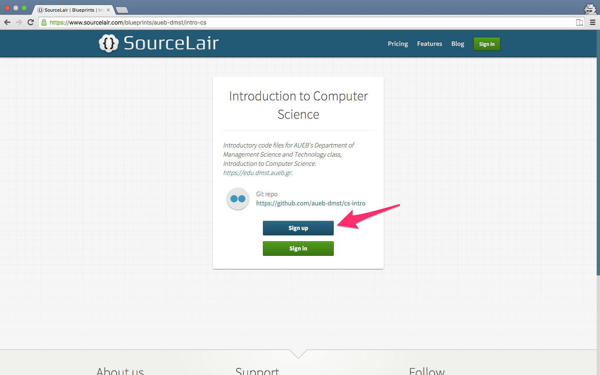
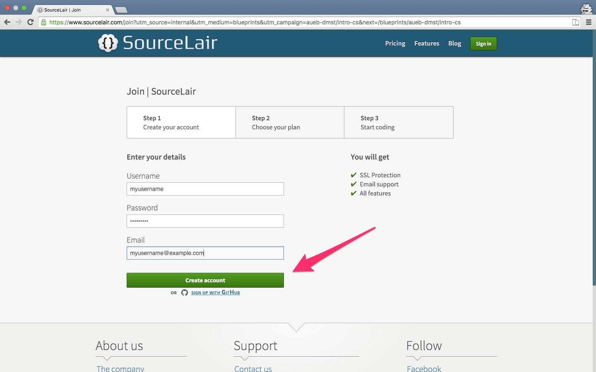
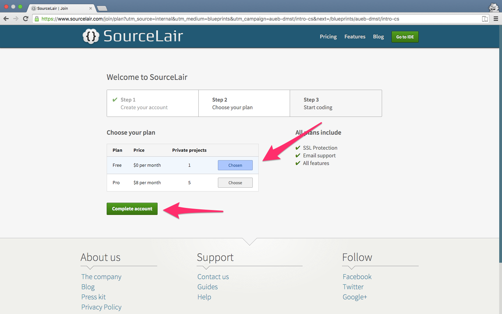
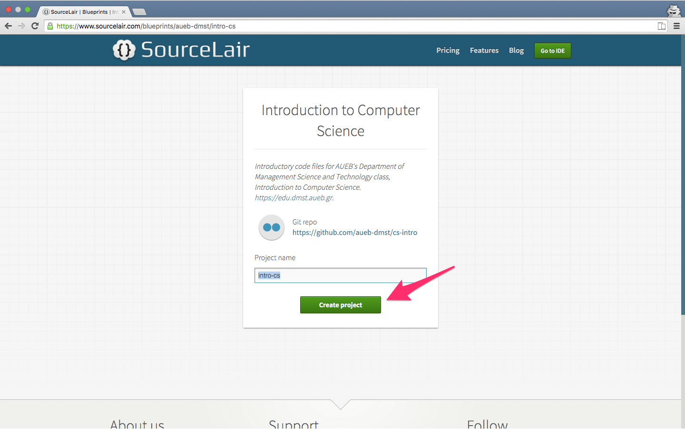
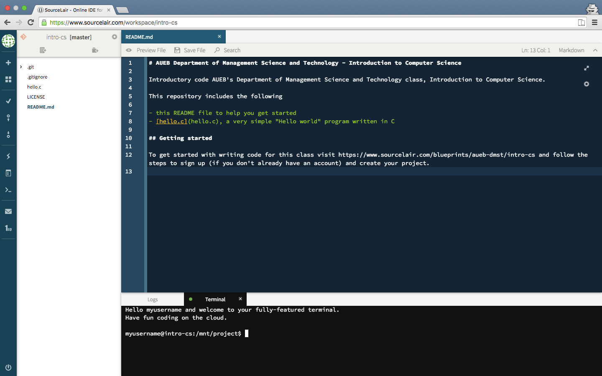

# Introduction to Computer Science

Introductory code AUEB's Department of Management Science and Technology class, Introduction to Computer Science.

This repository includes the following

- this README file to help you get started
- [hello.c](hello.c), a very simple "Hello world" program written in C

## Getting started

To get started with writing code for this class visit https://www.sourcelair.com/blueprints/aueb-dmst/intro-cs and follow the steps to sign up (if you don't already have an account) and create your project.

After creating your project open `hello.c` by double clicking on it and hit **Run File** to run it in your browser.

### Step by step instructions

1. Go to https://www.sourcelair.com/blueprints/aueb-dmst/intro-cs
2. Choose **Sign up**
   
3. Create account
   
4. Keep the **Free** plan selection and click **Complete account**
   
5. Click on **Create project** to create your project
   
6. Take the tour SourceLair and start coding
   
